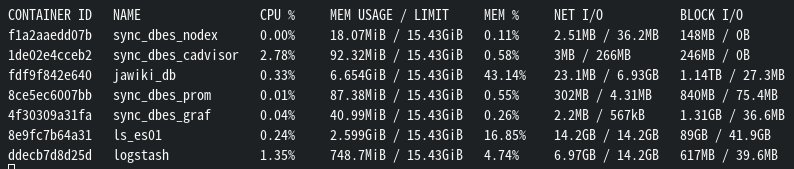

# Realtime Synchronize Database on Elasticsearch
頼むンゴねえ

- [Realtime Synchronize Database on Elasticsearch](#realtime-synchronize-database-on-elasticsearch)
  - [Summary](#summary)
- [Preparation](#preparation)
  - [MySQLの準備](#mysqlの準備)
    - [既存のMySQLデータベースを使用する場合](#既存のmysqlデータベースを使用する場合)
    - [MySQLデータベースを新規で作成する場合](#mysqlデータベースを新規で作成する場合)
  - [Logstashの準備](#logstashの準備)
- [Build](#build)
  - [とりあえず試す場合](#とりあえず試す場合)
  - [リソースの監視をする場合](#リソースの監視をする場合)
- [Test](#test)
  - [Elasticsearchの負荷テスト](#elasticsearchの負荷テスト)
- [Environment](#environment)
  - [File Structure](#file-structure)
- [References](#references)
- [memo](#memo)
  - [To Do](#to-do)

## Summary

Logstashは定期的(今回の設定は30秒おき)にRDBのデータを確認し、最後に実行した時間とRDBの各レコードの`refixdate`を比較して、追加・更新のあったレコードのみをElasticsearchに反映します。


# Preparation
## MySQLの準備
### 既存のMySQLデータベースを使用する場合
1. `.env`ファイルを作成し、下記の設定を入力します。

    ```
    MYSQL_HOST=(MySQLのホスト)
    MYSQL_PORT=(MySQLのポート)
    MYSQL_DATABASE=(DB名)
    MYSQL_USER=(ログインするユーザー名)
    MYSQL_PASSWORD=（MYSQL_USERのパスワード）
    MYSQL_ROOT_PASSWORD=（rootのパスワード）
    ```

    ※LogstashからMySQLに接続する際、SELECT以上の権限を持つユーザーでログインする必要があります。root以外のユーザーでログインするときは`logstash/pipeline/mysql.conf`の`jdbc_user`と`jdbc_password`を変更してください。この場合MYSQL_ROOT_PASSWORDは記載不要です。
2. `docker-compose.yaml`から`mysql`と`volumes`のブロックをコメントアウトしてください。
3. データベースから取ってElasticsearchに流したいデータに応じて下記を編集してください。
    - `./logstash/pipeline/mysql.conf`の`statement`
    - `./logstash/jawiki_index.json`の`mappings`内

 **

### MySQLデータベースを新規で作成する場合

1. `mysql.env`ファイルを作成し、下記の設定を入力します
    ```
    MYSQL_HOST=mysql
    MYSQL_PORT=3306
    MYSQL_DATABASE=wikipedia
    MYSQL_USER=(適当)
    MYSQL_PASSWORD=（適当）
    MYSQL_ROOT_PASSWORD=（適当）
    ```

2. テスト用データをインストールします。
    ```
    wget -P https://dumps.wikimedia.org/other/cirrussearch/current/jawiki-20211227-cirrussearch-content.json.gz
    gunzip -c jawiki-20211227-cirrussearch-content.json.gz > python/jawiki-20211227-cirrussearch-content.json
    ```

3. `docker-compose up --build`のあとに`python/register_db.py`を実行します。
    ```
    python python/register_db.py
    ```

## Logstashの準備
MySQLとLogstashの接続に必要な`MySQLコネクタ`([MySQL :: Download Connector/J](https://dev.mysql.com/downloads/connector/j/))をインストール
   ```
    wget https://dev.mysql.com/get/Downloads/Connector-J/mysql-connector-java-8.0.28.zip
    unzip mysql-connector-java-8.0.28.zip -d logstash/
   ```


# Build
## とりあえず試す場合
```
docker-compose up --build
```


## リソースの監視をする場合
```
docker-compose -f docker-compose.yaml -f docker-compose.ms.yaml up --build
```

- http://localhost:3000/ から各コンテナのリソース使用状況が確認できる
  - ユーザー名・パスワードはともに`admin`
- `docker stats`でもこういうのは見れる
  

# Test
## Elasticsearchの負荷テスト
`Rally` ([GitHub](https://github.com/elastic/rally) / [公式ドキュメント](https://esrally.readthedocs.io/en/stable/index.html))を使用。  
実験環境ではホストに`pip install esrally`でインストールしたほうが手間が少ないと判断しましたが、公式でDockerイメージも提供されているのでそちらを利用するのも手。  
*dockerを利用する場合はコンテナ内に入っておくことと、以下の説明等において適切なElasticsearchのアドレスに置き換えるよう留意してください。*

1. テスト用のデータを作成します。

    ```
    esrally create-track --track=test --target-hosts=localhost:9200 --indices="jawiki_articles" --output-path=./rally
    ```

    `./rally/test`に以下のファイルが作成されます。

    ```
    jawiki_articles-documents-1k.json      jawiki_articles-documents.json      jawiki_articles-documents.json.offset  track.json
    jawiki_articles-documents-1k.json.bz2  jawiki_articles-documents.json.bz2  jawiki_articles.json                   
    ```

2. `track.json`をよしなに編集します。


# Environment 

## File Structure
()は.gitignoreしてるやつ


```
documents/
  ┗preparation.md
elasticsearch/
  ┣build/
  ┃  ┗Dockerfile
  ┗config/
      ┗elasticsearch.yml
logstash/
  ┣build/
  ┃  ┗Dockerfile
  ┣config/
  ┃  ┣logstash.yml
  ┃  ┗pipelines.yml
  ┣(mysql-connector-java-8.0.28)
  ┃  ┣  ︙
  ┃  ┗(mysql-connector-java-8.0.28.jar) # MySQLコネクタ
  ┣pipeline/
  ┃  ┗mysql.conf    # Logstash→Elasticsearchに流す用の設定
  ┗jawiki_index.json    # Elasticsearchのインデックス構造を書いたファイル
monitoring_resources/
  ┣grafana/   # リソースの使用状況が可視化されるやつ
  ┃  ┣dashboards/
  ┃  ┃  ┣dashboard.yaml
  ┃  ┃  ┗main_rev5.json
  ┃  ┗datasource.yaml
  ┗prometheus/   # メトリクス取得するやつ
      ┗prometheus.yaml
mysql/
  ┣build/
  ┃  ┣Dockerfile
  ┃  ┗my.cnf
  ┗init/    # MySQLのコンテナ初回起動時に実行されるファイル
      ┗1_create_table.sql
python/
  ┣(jawiki-20211227-cirrussearch-content.json)    # テスト用データ
  ┗register_db.py
(mysql.env)    # 環境変数とか
docker-compose.ms.yaml  # リソース監視する用
docker-compose.yaml
README.md
```

---

# References
- [Elasticsearchクラスターのデータベースデータのリアルタイム同期（mysql） - コードワールド](https://www.codetd.com/ja/article/11891206) (最終閲覧日:2022/1/19)
- [LogstashおよびJDBCを使用してElasticsearchとRDBMSの同期を維持する方法 | Elastic Blog](https://www.elastic.co/jp/blog/how-to-keep-elasticsearch-synchronized-with-a-relational-database-using-logstash) (最終閲覧日:2022/1/19)
- [Elasticsearchの負荷テストにはRallyを使おう - Qiita](https://qiita.com/kinshotomoya/items/208c799aa695a073d33b) (最終閲覧日:2022/3/10)

---

# memo
## To Do
- ~~DB上の追加・更新をElasticsearchに反映させる~~
- ~~Logstashのpipelineのstatementがもう少しスマートにならんかなあ~~
- ~~LogstashとElasticsearchのリソース確認する~~ 
  - logstash, esともに2.0GBぐらい常に使ってるっぽい　一番多いのはmysql……
  - shard:3にしたらlogstashが4.5GB, esが2.0GBぐらい
  - ~~シャード数はcpuを効率的に使う場合に増やしたほうがいいらしい~~
  - シングルノードならRAID構成にしてないとシャードに分ける意味ないっぽい
- ~~DB上の削除はES上で反映されないのなんとかなんないかな~~
  - 今回は元のDBで削除することがないので考える必要がなさそう
- 無停止でインデックス更新するやつを試す
- 関連度スコアをわかりやすいかたちに出力できないか試す